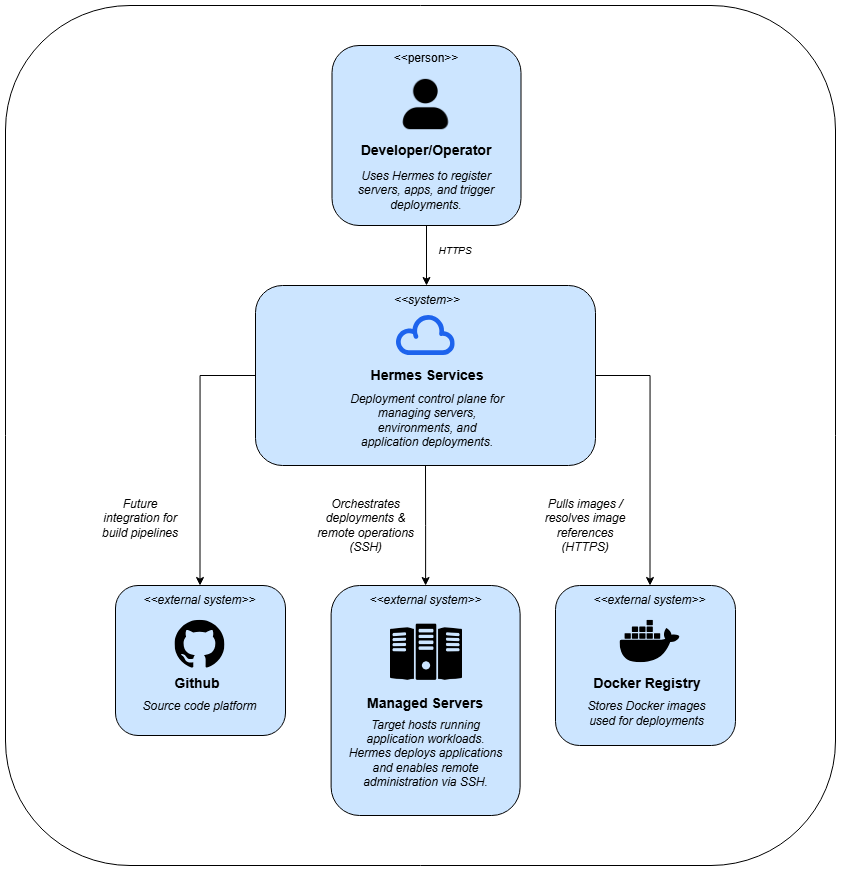
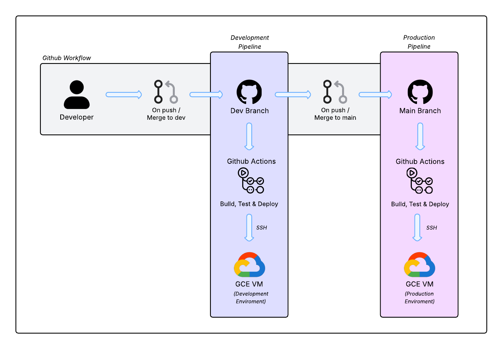

# Hermes Deploy Services

## Overview

Hermes is a backend-driven deployment control plane that helps solo developers
and small teams manage servers and deploy Docker-based applications safely.

- Centralized registry for servers, apps, images, and environments
- One-click server setup and application deployment
- Built-in real-time SSH terminal via WebSockets
- Internal tool evolving into a multi-user platform

   
   

If you're interested in system design, infrastructure automation,
or backend-heavy platforms, continue reading below.

## Table of Contents

1. [Overview](#overview)
2. [Problem Statement](#problem-statement)
3. [Design Philosophy](#design-philosophy)
4. [Architecture Overview](#architecture-overview)
   - [System Context (C4 – Level 1)](#system-context-c4--level-1)
   - [Container Architecture (C4 – Level 2)](#container-architecture-c4--level-2)
   - [Internal Components (C4 – Level 3)](#internal-components-c4--level-3)
5. [Core Concepts (Domain Model)](#core-concepts-domain-model)
6. [Control Plane UI](#control-plane-ui)
7. [Product Walkthrough](#product-walkthrough)
8. [Real-Time Terminal (WebSocket → SSH)](#real-time-terminal-websocket--ssh)
9. [Deployment & Infrastructure](#deployment--infrastructure)
10. [CI/CD Pipeline](#cicd-pipeline)
11. [Security Model](#security-model)
12. [Tradeoffs & Limitations](#tradeoffs--limitations)
13. [Roadmap](#roadmap)
14. [Tech Stack](#tech-stack)
15. [Who This Is For (and Who It’s Not)](#who-this-is-for-and-who-its-not)
16. [Author & Motivation](#author--motivation)

> **Reading guide:**
If you're interested in **system design**, read until **Architecture Overview**.
If you want implementation details, continue to Domain Model and Walkthrough.

## Problem Statement

Hermes Deploy Services originated as a **Python package and CLI tool** designed to automate server management and deployment-related tasks such as server access, setup, and CI/CD-oriented workflows.

In its initial form ([DHermes](https://github.com/steven-mendoza-z/DHermes), published as [`hermes-deployer`](https://pypi.org/project/hermes-deployer/)), the goal was to provide a lightweight, scriptable way to:
- manage server connections,
- automate repetitive operational tasks,
- and standardize deployment-related actions for individual developers.

As usage patterns became clearer, a recurring limitation emerged:  
while automation scripts worked well for experienced operators, **developers with limited DevOps experience struggled with discoverability, visibility, and operational safety**.

Common issues included:
- lack of a centralized view of servers, applications, and environments,
- difficulty understanding the current deployment state,
- operational actions being hidden behind scripts and commands,
- and high cognitive load for non-DevOps-focused developers.

Hermes evolved from this foundation into a **backend-driven deployment control plane**, aiming to make these workflows:
- more visible,
- more structured,
- and more accessible through a user-friendly interface,

while preserving the same underlying operational primitives (SSH, Docker, Compose) instead of replacing them with opaque abstractions.

Today, Hermes operates as an **internal tool for trusted operators**, while intentionally laying the groundwork for a future **multi-user deployment platform** that enables developers to manage servers and deployments safely without deep infrastructure expertise.

## Design Philosophy

Hermes builds on lessons learned from its origins as a CLI-first automation tool, evolving towards a platform that prioritizes clarity, safety, and accessibility without hiding infrastructure realities.

Hermes is designed around pragmatic principles that balance automation, clarity, and developer experience.

### 1. Control Plane vs Data Plane separation
Hermes operates as a **control plane** responsible for orchestration, visibility, and coordination, while target servers act as the **data plane**, executing workloads and running applications.

This separation keeps responsibilities clear: Hermes decides *what* should happen; servers execute *how* it happens.

### 2. Registry-first domain modeling
Instead of treating deployments as scripts or one-off commands, Hermes models the deployment domain explicitly:
- Servers
- Docker images
- Applications
- Environments
- Environment variables

This registry becomes a **single source of truth** for small teams that typically lack one.

### 3. Developer-friendly automation
Hermes focuses on automating the most error-prone and repetitive operational tasks:
- server setup and reverse-proxy configuration,
- environment variable management per application,
- application deployment from registered Docker images,

without requiring developers to master complex infrastructure tooling upfront.

### 4. Transparent runtime over hidden abstractions
Hermes intentionally builds on familiar and debuggable primitives:
- Docker and Docker Compose
- host-based reverse proxy routing
- automated TLS via ACME

Avoiding opaque abstractions ensures developers can reason about failures and extend the system as needed.

### 5. Operational access as a first-class feature
Automation does not eliminate the need for inspection and intervention.  
Hermes includes a real-time terminal (WebSocket → SSH) to allow operators to safely access servers directly from the control plane when required.

### 6. Designed for gradual evolution to multi-user
Although Hermes currently assumes **trusted operators**, the system is intentionally structured to support a gradual evolution into a multi-user product:
- explicit resource ownership via registry models,
- centralized control plane boundaries,
- clear separation between orchestration and execution.

This allows new concerns such as authentication, authorization, and tenancy to be introduced incrementally without redesigning core deployment flows.

## Architecture Overview

Hermes is composed of two main layers: a **Control Plane** and a **Data Hermes follows a control-plane / data-plane architecture, where the UI and API orchestrate deployments while servers execute workloads.

### System Context (C4 – Level 1)

  

### Container Architecture (C4 – Level 2)

  

### Internal Components (C4 – Level 3)

  

## Core Concepts (Domain Model)

Hermes models deployment and infrastructure concepts explicitly instead of treating deployments as opaque scripts.  
This registry-first approach provides a clear and queryable source of truth for operational state.

### Server
Represents a physical or virtual machine capable of running workloads.

A server encapsulates:
- network identity (IP, region),
- ownership / project association,
- SSH access configuration,
- operational status (reachability).

Servers act as execution targets for deployments and host shared infrastructure components such as the reverse proxy gateway.

---

### Repository
Represents a source code repository associated with one or more applications.

Repositories provide traceability between deployed artifacts and their source, enabling:
- visibility into where images originate,
- future integrations with CI/CD pipelines.

---

### Image (Docker Image)
Represents a deployable Docker image.

Images are treated as first-class deployment artifacts and may include:
- repository association,
- branch and version metadata.

This allows deployments to be decoupled from source code while maintaining traceability.

---

### Application
Represents a runnable service deployed to a server.

An application links together:
- a Docker image,
- a target server,
- a deployment domain,
- and one or more environments.

Applications define *what* is deployed and *where* it runs.

---

### Environment
Represents a logical configuration context for an application (e.g. `.env`, `production`, `staging`).

Environments group environment variables and allow configuration to evolve independently from application code.

---

### Environment Variable
Represents a key-value configuration entry scoped to an environment.

Environment variables are treated as sensitive operational data and are:
- write-only when created or updated,
- never exposed in plaintext after creation.

This mirrors common secret-management patterns while keeping the system simple.

## Control Plane UI

The Hermes Control Plane UI provides a centralized interface for managing deployment resources and operational workflows.

Rather than abstracting infrastructure away, the UI focuses on **making infrastructure state visible and manageable**.

Key responsibilities include:
- registering and managing servers,
- maintaining a registry of repositories, images, and applications,
- managing environment configuration per application,
- triggering deployments,
- and enabling safe operational access.

The UI is designed to support both desktop and mobile layouts and adapts its interaction patterns accordingly.

### Registry-driven views
Each core concept (servers, images, repositories, applications) is exposed through structured, searchable tables that reflect the underlying domain model.

This allows operators to:
- understand system state at a glance,
- trace relationships between resources,
- and perform targeted actions without navigating multiple tools.

### Action-based workflows
Operational actions (deploy, setup, edit, inspect) are context-aware and scoped to the selected resource, reducing the risk of accidental changes and improving discoverability for less experienced users.

## Product Walkthrough

A typical workflow in Hermes follows a progressive and explicit sequence:

### 1. Register a Server
A server is added to the registry by providing its basic metadata (IP, region, project, user).

Hermes generates the required SSH setup command, allowing the operator to establish secure access without manual key management.

---

### 2. Server Setup
Once registered, the server can be bootstrapped directly from the control plane.

This setup phase:
- installs required system dependencies,
- provisions Docker and Docker Compose,
- deploys a shared reverse proxy gateway with automated TLS,
- and prepares the server for application deployments.

---

### 3. Register Deployment Resources
Operators register:
- repositories (source reference),
- Docker images (deployable artifacts),
- and applications that bind images to servers and domains.

This step establishes a clear mapping between code, artifacts, and runtime environments.

---

### 4. Configure Environments
Each application includes one or more environments.

Environment variables are defined per environment, allowing configuration to change independently of the deployment logic.

---

### 5. Deploy the Application
With a server configured and an application registered, deployments can be triggered directly from the control plane.

Hermes orchestrates the deployment by:
- resolving the target server,
- selecting the configured Docker image,
- and executing the required Docker Compose operations remotely.

---

### 6. Operate and Inspect
After deployment, operators can:
- inspect application state,
- monitor server reachability,
- and access a real-time terminal session when deeper inspection or intervention is required.

This ensures that automation and manual control coexist without forcing operators to leave the platform.

## Real-Time Terminal (WebSocket → SSH)

## Deployment & Infrastructure

## CI/CD Pipeline

   

## Security Model

## Tradeoffs & Limitations

## Roadmap

## Tech Stack

### ☁️ Protocols & System Interfaces

---

### ⚙️ Backend

-2C2D72.svg?style=for-the-badge&logoColor=white)

<!--  -->
<!--  -->
<!--  -->

> Notes: API docs via `drf-spectacular`, auth via `dj-rest-auth` + `django-allauth`, and WebSocket terminal via Channels + Paramiko.

---

### 🖥️ Frontend (Control Plane UI)

---

### ☁️ Infrastructure & DevOps

> Notes: Reverse proxy gateway via `jwilder/nginx-proxy` + `acme-companion` on a shared external Docker network.

## Who This Is For (and Who It’s Not)

## Author & Motivation

